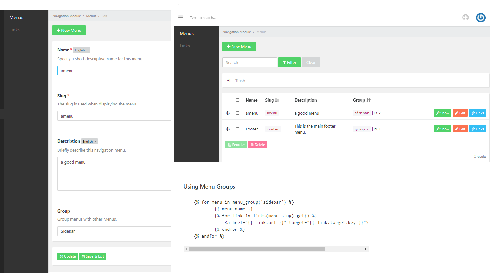

# Menugator Extension
This menugator extension provides for PyroCMS 3.8.

Menugator does not replace the Navigation Module, it extends the current functionality, if you uninstall Menugator, you will not lose your menus.


#### The Problem
This menugator extension provides useful additional features to the Navigation Module.

I found that the PyroCMS Navigation module was missing the ability to Group menus and sort them.


This extension also provides an additional plugin to get the list of grouped menus.


### Menu Group Plugin
In the admin section, there is a 'Show' button that will show you a quick start integration code so you can quickly intyegarte the mnenus onto your theme.

The below plugin is the ebst way to describe what this can do for your PyroCMS installation.
You could have 4 or 5 different menus for the footer, if you groups them you can display them easily like so;
```
    
            <h5>{{ menu.name }}</h5>
            <ul>
            
                <li><a href="{{ link.url }}" target="{{ link.target.key }}">{{ link.title }}</a></li>
            
            </ul>
    
```
### Screenshot
Ordering Menus



#### Version 1.0.0

*thrive.extension.menugator*


### Requirements

- PyroCMS 3.8

### Installation


1. Download to your PyroCMS installtion to a folder `/addons/default/thrive/`. This extension folder must be named `menugator-extension`.
2. Using terminal
```
composer dump-autoload
php artisan addon:install thrive.extension.menugator
```

